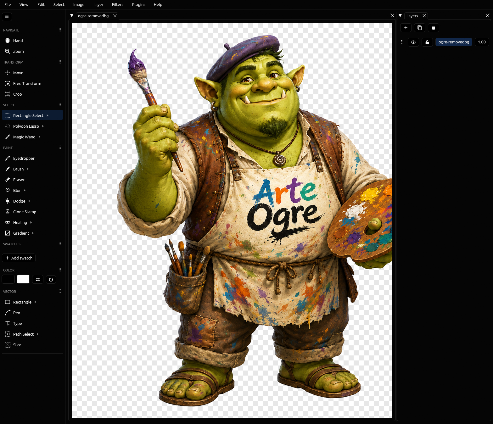
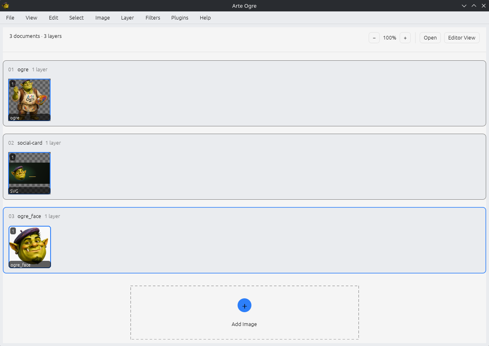

<p align="center">
  
</p>

<h1 align="center">Arte Ogre</h1>

<p align="center">
  <b>A Rust-native, GPU-accelerated layered image editor.</b>
  <br />
  Paint, composite, select, and cut out — with <b>layers done right</b>.
  <br />
  Fast Rust core · egui + wgpu GPU canvas · sparse tiled copy-on-write engine · no telemetry · GPL-3.0-only.
</p>

<p align="center">
  <a href="https://github.com/visorcraft/Arte-Ogre/releases/latest"></a>
  <a href="LICENSE"></a>
  
  
  
</p>

<p align="center">
  
</p>

<p align="center">
  
</p>

---

## What is Arte Ogre?

Arte Ogre is a desktop image editor built around one promise most editors break:
**layers keep their exact position.** Rectangle-select a region, right-click,
and **Cut/Copy to New Layer** drops the content onto a fresh layer at its *exact*
original canvas coordinate — pixel for pixel. That guarantee falls out of the
data model (sparse tiled copy-on-write buffers), not UI bookkeeping.

It is built around three goals:

- **GPU-native.** The whole document composites on the GPU through `wgpu`,
  sharing the same device as the UI for a zero-copy canvas, and recomposites
  only the **dirty tiles** per edit — so a deep layer stack stays interactive.
- **Correct by construction.** 32-bit float RGBA, straight alpha, **linear
  light**. Every GPU result is golden-tested against a CPU reference compositor
  within `1e-4` per channel; the killer cut/copy feature is pinned by a
  byte-identical round-trip test.
- **Offline and yours.** Pure-Rust core, no network calls, no telemetry. The
  optional AI background-refine model is the only thing that ever downloads, and
  only when you ask for it.

### What it does today

- **Layers** — raster, groups, blend modes, opacity, non-destructive ordering;
  cheap duplicate and undo via copy-on-write tiles.
- **Bird's Eye View** — a full-workspace layer organizer: view every open
  document as a card, reorder root layers by dragging thumbnails, move or copy
  layers between documents, and double-click a thumbnail to jump back to the
  editor with that layer active.
- **Selection** — Rectangle, Ellipse, Polygon Lasso (live), Freehand Lasso, and
  a perceptual Magic Wand, all with real marching-ants outlines, Select Inverse,
  and Copy/Cut to a new layer or the clipboard.
- **Paint** — brush, pencil, eraser (pressure-aware), paint bucket, eyedropper,
  tiled brush/stroke rasterization, and brush-engine tools for clone/heal,
  blur/sharpen/smudge, dodge/burn/sponge, and color replacement.
- **Vector** — Shape, Pen, and Type create **non-destructive, re-editable vector
  layers** (a per-tool Vector/Pixels toggle); select a vector layer to load it
  back into the tool and edit in place.
- **Transform** — move, free transform (scale/rotate/skew), crop.
- **Remove Background** — lift a solid or checkerboard "fake transparency" matte
  to true alpha, losslessly, with edge defringe — plus an optional AI matte
  refine (IS-Net via pure-Rust ONNX) for fine hair.
- **Filters & color** — GPU compute filters with a CPU fallback; ICC color via
  `lcms2`.
- **Files** — native `.ogre` (zstd tiles + msgpack), `.ora` interchange,
  PSD / EXR / TIFF / PNG / JPEG / WebP via the `image` crate, and SVG
  import/export (raster, vector, or hybrid) via `resvg`/`usvg`.
- **Extensible** — sandboxed tile filters via `wasmtime` (stable WIT contract,
  fuel- and memory-bounded) and `mlua` Lua scripting.

---

## Setup (build from source)

Arte Ogre is a standard Cargo workspace.

**Prerequisites**

- Rust toolchain (2021 edition).
- A Vulkan-capable GPU and drivers (Linux; `wgpu` selects Vulkan).
- For the AppImage: `linuxdeploy` and `appimagetool` on `PATH`, plus
  ImageMagick (`magick`) for icon resizing.

**Build & run**

```sh
git clone https://github.com/visorcraft/Arte-Ogre.git
cd Arte-Ogre

cargo run -p ogre                 # launch the editor (eframe + wgpu)
cargo run -p ogre -- image.png    # open a file on startup
```

**Quality gate** (run before any commit; warnings are hard errors)

```sh
cargo test   -p <crate>
cargo clippy -p <crate> --all-targets -- -D warnings
cargo fmt    --check
cargo doc    -p <crate>          # use --no-deps to skip dependency docs
```

`scripts/gate.sh` wraps test + clippy + fmt for `ogre-core`.

After dependency changes, regenerate the third-party attribution files:

```sh
scripts/licenses.sh   # requires cargo-about
```

---

## Install

The release build packages into a single-file **AppImage** installed under
`~/.local/bin` without root.

```sh
cargo build --release -p ogre

# One-time: linuxdeploy + appimagetool on PATH (continuous static builds)
curl -L https://github.com/linuxdeploy/linuxdeploy/releases/download/continuous/linuxdeploy-x86_64.AppImage -o ~/.local/bin/linuxdeploy
curl -L https://github.com/AppImage/appimagetool/releases/download/continuous/appimagetool-x86_64.AppImage -o ~/.local/bin/appimagetool
chmod +x ~/.local/bin/linuxdeploy ~/.local/bin/appimagetool

# AppDir: binary + .desktop + 256×256 icon, then build the AppImage.
# NO_STRIP=1 is required where libraries use DT_RELR relocations.
rm -rf AppDir && mkdir -p AppDir/usr/bin AppDir/usr/share/applications \
  AppDir/usr/share/icons/hicolor/256x256/apps
cp target/release/ogre AppDir/usr/bin/arte-ogre
magick assets/ArteOgre.png -resize 256x256 \
  AppDir/usr/share/icons/hicolor/256x256/apps/arte-ogre.png
cat > AppDir/usr/share/applications/arte-ogre.desktop <<'EOF'
[Desktop Entry]
Name=Arte Ogre
Exec=arte-ogre %F
Icon=arte-ogre
Type=Application
Categories=Graphics;2DGraphics;RasterGraphics;
Comment=GPU-native image editor
Terminal=false
StartupWMClass=arte-ogre
MimeType=image/png;image/jpeg;image/webp;image/avif;image/tiff;image/x-ora;
EOF
NO_STRIP=1 linuxdeploy --appdir AppDir \
  --desktop-file AppDir/usr/share/applications/arte-ogre.desktop \
  --icon-file AppDir/usr/share/icons/hicolor/256x256/apps/arte-ogre.png \
  --output appimage   # → Arte_Ogre-x86_64.AppImage

install -Dm755 Arte_Ogre-x86_64.AppImage ~/.local/bin/arte-ogre
```

> **Wayland title-bar icon.** Wayland has no per-window icon protocol — the
> compositor takes the icon from a desktop entry matching the window's `app_id`
> (`arte-ogre`). Install the same `.desktop` + icon into your data dir so it
> resolves: copy `arte-ogre.desktop` to `~/.local/share/applications/` and the
> 256×256 icon to `~/.local/share/icons/hicolor/256x256/apps/arte-ogre.png`.

After install, launch with `arte-ogre [image.png …]`.

> **Linux backend.** Defaults to winit's native backend (Wayland on a Wayland
> session — smooth resize). Set `ARTE_OGRE_X11=1` to force X11/XWayland, the
> only backend with file drag-and-drop. `File → Open` works on both.

---

## The stack

| Layer | Choice |
| --- | --- |
| **Language** | Rust 2021, Cargo workspace |
| **UI shell** | `egui` + `eframe` + `egui_dock` |
| **Graphics** | `wgpu` (Vulkan on Linux), WGSL shaders via `naga` |
| **Layer engine** | sparse **tiled copy-on-write** buffers · 32-bit float RGBA (linear) · per-layer offset |
| **Compositing** | `wgpu` passes · blend modes as shaders · dirty-tile updates |
| **Vector / brush** | `lyon` · `kurbo` · `cosmic-text` |
| **I/O** | `image`, `psd`, `exr`, `tiff` · native `.ogre` (zstd + msgpack) · `.ora` · SVG |
| **Color** | `lcms2` (ICC) |
| **AI matte** | IS-Net via pure-Rust ONNX (`tract`), optional `ml` feature |
| **Plugins** | `wasmtime` (WASM) + `mlua` (Lua), sandboxed |

The crates form one dependency chain: `ogre-core` → `ogre-gpu` → `ogre-ui` →
`ogre` (binary), with `ogre-io`, `ogre-plugins`, and `ogre-vector` alongside.
`ogre-core` is the headless ground truth and is `#![deny(unsafe_code)]`.

---

## Contribute

Patches, bug reports, and design feedback are welcome. See
**[CONTRIBUTING.md](CONTRIBUTING.md)** for the full workflow, coding standards,
and the engine invariants every change must respect.

- Fork on GitHub, branch from `master`, send a PR.
- Run the per-crate quality gate before pushing — it must pass with zero
  warnings.
- Arte Ogre is GPL-3.0-only. Development follows a TDD, checkbox-driven flow
  (write test → verify fail → implement → verify pass).

Found a vulnerability? Please follow the **[security policy](SECURITY.md)** —
don't open a public issue.

---

## Documentation

- [Contributing](CONTRIBUTING.md) · [Security policy](SECURITY.md)
- [Credits](CREDITS.md) · [Third-party licenses](THIRD_PARTY_LICENSES.md)

---

## Licence

Arte Ogre is licensed under the
[GNU General Public License v3.0 only](LICENSE).
